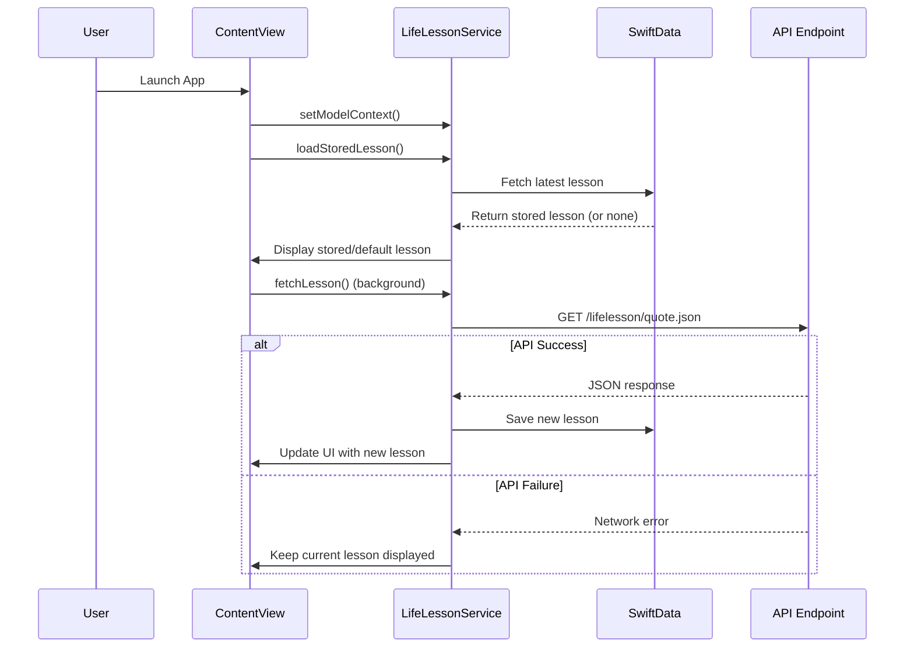
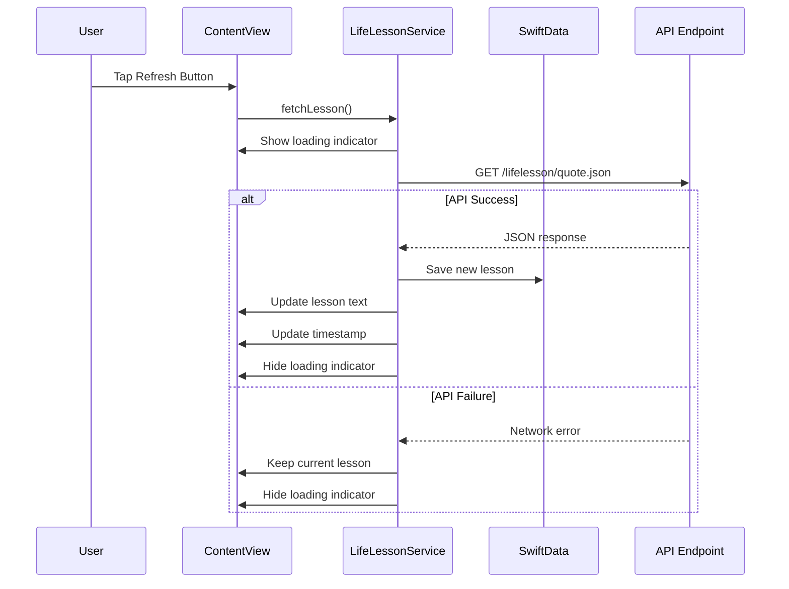
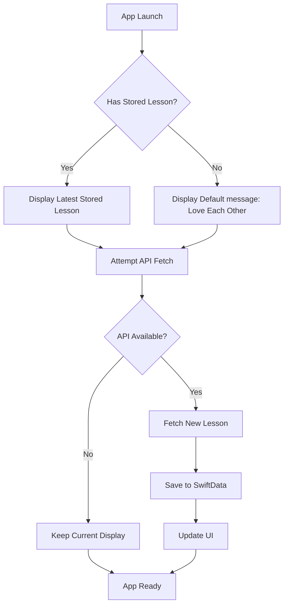

# AdHocLifeLessons

A beautiful, minimalist iOS and macOS app that displays daily life lessons and inspirational quotes. The app fetches wisdom from a remote API and gracefully handles offline scenarios with local storage.

## Features

- 📱 **Cross-Platform**: Runs on iOS, iPadOS, macOS, and tvOS
- 🔄 **Auto-Refresh**: Automatically fetches fresh lessons on app launch
- 💾 **Offline Support**: Stores lessons locally using SwiftData
- 🎨 **Beautiful Typography**: Large, centered text with Georgia serif font for optimal readability
- 📱 **Responsive Design**: Works in any orientation and screen size
- ⏰ **Smart Footer**: Shows last update time and manual refresh option

## How It Works

The app displays life lessons retrieved from `https://rohand.app/lifelesson/quote.json`. When the API is unreachable, it falls back to the last stored lesson or shows the default message "Love Each Other".

### API Response Format
```json
{
  "ts": "20250731",
  "v": 1,
  "s": "Life is Happy"
}
```

- `ts`: Timestamp when the lesson was last updated
- `v`: Version number of the lesson
- `s`: The actual lesson text to display

## Architecture

The app is built using SwiftUI and SwiftData with a clean MVVM architecture:

- **ContentView**: Main UI displaying the lesson and footer
- **LifeLessonService**: Handles API calls and data management
- **LifeLesson**: SwiftData model for local storage

## Message Loading Flow

### App Launch Flow


### Manual Refresh Flow


### Data Storage Strategy


## Installation

1. Clone this repository
2. Open `AdHocLifeLessons.xcodeproj` in Xcode
3. Build and run on your preferred device/simulator

## Requirements

- iOS 17.0+ / macOS 14.0+ / tvOS 17.0+
- Xcode 15.0+
- Swift 5.9+

## Technical Details

- **UI Framework**: SwiftUI
- **Data Persistence**: SwiftData
- **Networking**: URLSession with async/await
- **Architecture**: MVVM with Observable pattern
- **Error Handling**: Graceful degradation with offline support
